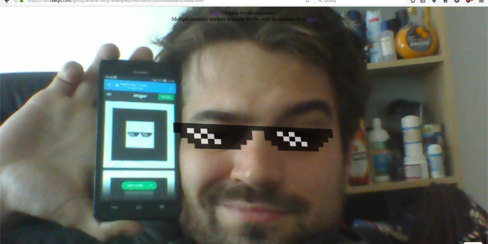

# Custom Markers test

This is a test of different markers, using the fantastic https://github.com/jeromeetienne/AR.js !
The markers are pretty bad, I wanted to know how will it work with random pictures inside the marker outline.

Check it out at: https://cdn.rawgit.com/gftruj/aframe-experients/9c946916/AR.js/customMarkers/index.html

## Assets

* My photo,
* Trip - animation, a .mp4 video from https://www.behance.net/ilonapietrzak
* 3D model with animation by rexraptor08 https://github.com/rexraptor08
* Random overwatch D.VA stuff: https://68.media.tumblr.com/6f7e564cd118365f7ad8536fea30c669/tumblr_o700z0ViCR1s1j03oo1_500.gif, http://i.imgur.com/HUgZRdo.jpg, https://steamuserimages-a.akamaihd.net/ugc/490152228927942849/CDC43DEE20B97B1A6640EB81AB43E7FB110DD6E3/
* Random meme compilation from http://imgur.com/gallery/0j1qH

### The size of the pictures is not a power of two, so if, will remake the assets when I'll have a while