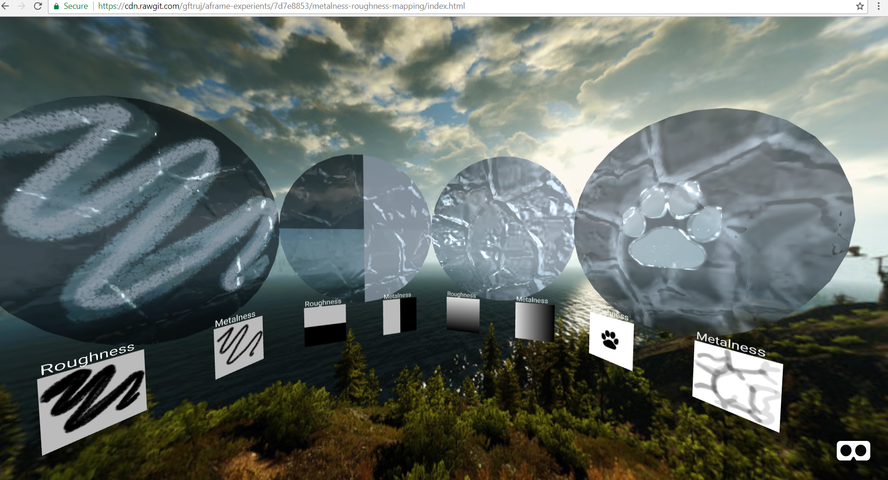

# Metalness and Roughness Mapping.
* Check it out @ https://cdn.rawgit.com/gftruj/aframe-experients/26f9b3e6/metalness-roughness-mapping/index.html
### Check out a couple of entities with metalness and roughness maps applied. Simple, yet powerful if You had the time to work on the maps. 
### You can switch some maps on one entity, for presentation sake.

